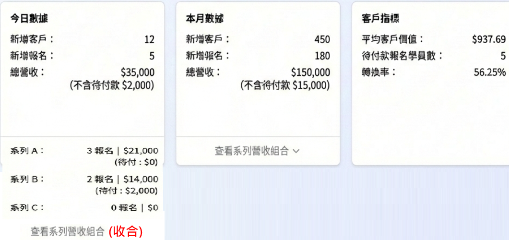
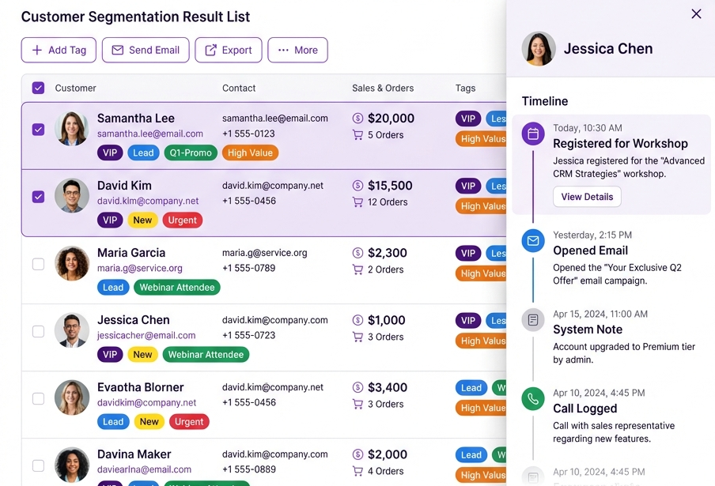
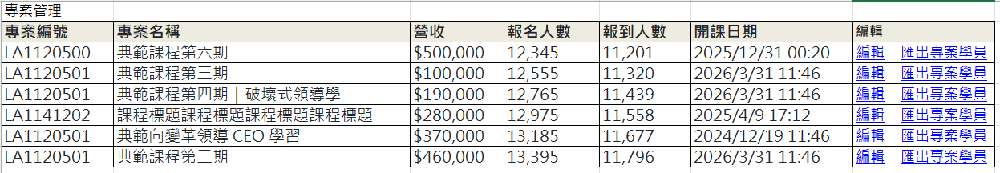
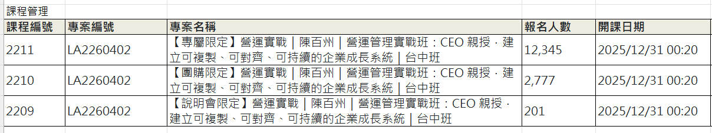
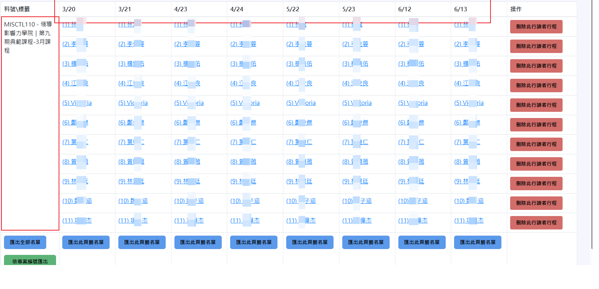
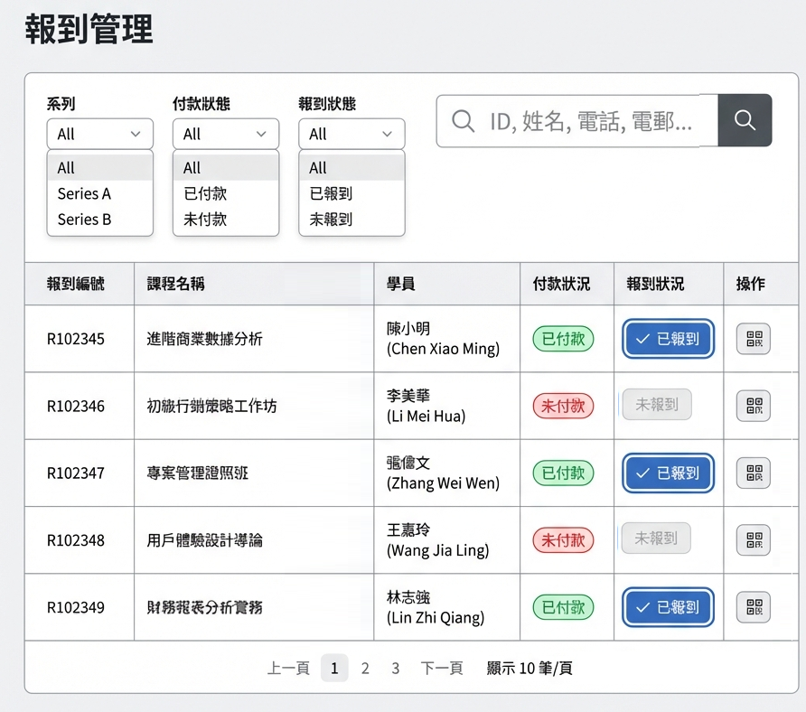
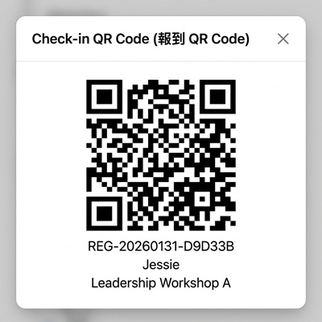

# VividooCRM 系統需求文件 (Product Requirements Document)

## 1 核心商務邏輯 (Core Business Logic)
VividooCRM ，整合了客戶關係管理、銷售訂單、課程活動管理、自動化行銷 (EDM) 系統。

*   **學員 (Students)**: 完成課程報名流程的正式學員。
*   **潛客 (Leads)**: 僅填寫諮詢表單，尚未完成報名的潛在客戶 (路人)。
*   **專案與課程架構**:
    *   每個「專案 (Project)」包含多堂「課程 (Courses)」。
    *   每門課程可能橫跨「多天 (Multi-day)」進行。
*   **學員代課機制 (Substitute Logic)**:
    *   學員報名多天課程後，支援中途換人出席 (指定某天由代課學員出席)。
    *   **代課人員來源**: 限制僅能 **「選取既有會員」**。
        *   說明: 若代課者為新用戶，需先完成基本資料建立，方可進行綁定。此舉旨在確保會員資料歸戶之完整性。
    *   系統需「如實紀錄」代課資訊 (包含原始學員與代課學員)。
    *   **自動化通知**: 課程通知須同步發送給當日的代課學員。
*   **多講師機制 (Multi-Instructor)**:
    *   每專案支援設定「多位講師 (Multiple Instructors)」，非單一講師限制。

### 1.2 系統邊界與整合架構 (System Boundary & Integration)
針對 **「既有內部訂單系統」** 與 **「本次外包開發範圍」** 之界定，採用 **「應用層與核心層分離 (Decoupled Architecture)」** 設計。

*   **內部核心層 (Internal Core)**：
    *   **角色**：負責「金流、發票、既有訂單紀錄」。
    *   **資料流向**：單向提供 (Provider)。
    *   **責任歸屬**：由貴司內部團隊維護，僅需提供 `GET /orders/export` 唯讀 API 供查詢或排程匯入。
*   **外包應用層 (VividooCRM)**：
    *   **角色**：負責「課程執行、報到狀態、代課邏輯、行銷紀錄」。
    *   **資料流向**：接收訂單資料後，於本地資料庫建立「擴充欄位 (Execution Data)」。
    *   **優勢**：外包廠商 **不需觸碰** 貴司核心資料庫，僅需透過標準 API 取得資料，即可獨立開發所有 CRM 功能。

---

## 2. 核心功能模組 (Core Modules)

### 2.1 營銷數據儀表板 (Dashboard)
提供管理層與行銷人員即時的營運數據視圖。
*    
*   **關鍵指標 (KPI Cards)**: 
    1.  **總客戶數**: OOO
        *   細項: 學員數 OOO | 潛客數 OOO
        *   轉換率: OO.OO% 
        *   *公式*: 總報名數 / 總客戶數 x 100%
        *   *公式*: 總客戶數 = 學員數 + 潛客數
        *   *公式*: 轉換率 = 總報名數 / 總客戶數 x 100%
    2.  **總營收**: OOO
        *   定義: 報名已付款金額加總
    3.  **總報名數**: OOO
        *   細項: 已付款學員數 OOO | 待付款學員數 OOO
        *   預期總報名金額: $OOO,OOO (含待付款)
        *   *公式*: 總報名數 = 已付款學員數 (不含待付款)
        *   *公式*: 預期總報名金額 = 總營收 + 待付款金額
    4.  **平均 CLV**: OOO
        *   定義: 基於預期總報名金額計算
        *   *公式*: (總營收 + 待付款金額) / 總報名數
    5.  **營收組合 (範圍: 今日 | 本週 | 本月)**
    *   
        *   **總體**: 新增客戶 OOO | 新增報名 OOO | 總營收收入 $OOO (不含待付款 OOO)
        *   **系列課程細分**:
            *   系列課程 A: 新增報名 OOO | 營收 $OOO (不含待付款 OOO)
            *   系列課程 B: 新增報名 OOO | 營收 $OOO (不含待付款 OOO)
            *   *(以此類推,都要顯示出來)*
    6.  **客戶指標 (Customer Metrics)**
        *   數據: 平均客戶價值 OOO | 待付款報名學員數 OOO | 轉換率 OO.OO%
        *   *公式*: 平均客戶價值 = 總營收 / 總客戶數 x 100%
        *   *公式*: 轉換率 = 總報名數 / 總客戶數 x 100%
*   **趨勢圖表**:
    *   `營收趨勢圖 (Revenue Trend)`: 視覺化特定期間內的銷售表現。
    *   `客戶成長圖 (Customer Growth)`: 追蹤新增會員與活躍會員趨勢。
    *   `訂單成長圖 (Order Growth)`: 訂單數量變化分析。
    *   `系列營收 (Series Revenue)`: 針對特定課程系列或產品線的營收貢獻分析。
*   **篩選功能**: 支援依據 `日期區間 (Date Range)` 與 `系列 (Series)` 與 `時間粒度(日/周/月/年)` 篩選數據。

### 2.2 客戶管理 (Customer CRM)
*   **以姓名和電話為Key**：客戶資料新蓋舊
*   **當API匯入購課學員資料時**：
    *   若該學員已存在於CRM中，則更新該學員資料；
    *   若不存在，則新增該學員資料。
*   **客戶列表 (Customer List)**:
    *   **基本資料**: 參考 [customers_import_template.xlsx](customers_import_template.xlsx)。
    *   **頭像**: 逐一設定；可新增/修改/刪除頭像
    *   **客戶狀態**：啟用/不啟用; **不提供**刪除功能
    *   **標籤 (Tags)**: 可以選擇現有的標籤;多選；但**不能**在此新增標籤。
*   **資料匯入**: 支援批次匯入客戶資料。

### 2.3 客戶分群管理 (Customer Segmentation Analysis)
> [!NOTE]
> 專為進階數據分析設計的獨立模組，支援多維度篩選與視覺化報表。

*   **篩選方式 (Advanced Filters)**:
    *   **快速篩選**: 支援一鍵套用 `SVIP 客戶`、`VIP 客戶`、`常客`、`高消費` 等預設條件。
    *   **自定義篩選**:
        *   **報名次數**: 設定最少/最多報名次數區間 (例如: 5~ 10次)    
        *   **消費金額**: 設定最低/最高消費區間 (例如: 1萬~5萬)。
        *   **系列課程**: 篩選特定系列或是全部系列。
        *   **標籤 (Tags)**: 用下拉選擇；可多選。
*   **分群數據概覽 (Segment Overview)**:
    *   顯示符合當前篩選條件的關鍵指標卡片：
        *   `符合條件客戶數` (Count)
        *   `總消費金額` (Total Spend)
        *   `平均報名次數` (Avg Registration)
        *   `涵蓋系列課程數` (Series Count)
*   **視覺化分析 (Visualization)**:
    *   **系列課程客戶分佈 (Bar Chart)**: 顯示各系列課程中的客戶數量分佈。
    *   **系列課程收入分佈 (Pie Chart)**: 顯示各系列課程的營收佔比。
*   **篩選結果列表 (Result List)**:
    *   
    *   **UI 佈局**: 混合型列表 (Hybrid List) + 資訊分層 (Rich Rows) + 側邊抽屜 (Side Drawer)。
    *   **列表顯示**:
        *   **Rich Rows 設計**: 採雙層顯示。
            *   **第一層**: 姓名、聯絡資訊 (Email/Phone) 與 關鍵數據 (消費金額、訂單數)。
            *   **第二層**: 標籤 (Tags) 列表，一眼掃描即可知道客戶屬性。
        *   **關鍵數據**: 採純數字呈現 (e.g. $20,000, 5 Orders)。
    *   **側邊抽屜 (Side Drawer)**:
        *   **互動**: 點擊單一客戶列時，右側滑出「速覽抽屜」，不離開列表。
        *   **內容**: 預設顯示「互動時間軸 (Timeline)」，包含近期報名、開信紀錄等，輔助判斷。
    *   **資料匯出**: 支援將篩選結果 `匯出 Excel`，方便外部作業。
    *   **批次操作 (Batch Actions)**:
        *   **常駐操作列 (Fixed Action Bar)**: 列表頂部常駐操作按鈕，支援勾選後執行。
        *   `批次新增標籤`: 勾選客戶後批次加入。
        *   `批次取消標籤`: 勾選客戶後批次移除。
        *   `批次寄信`: 勾選客戶後發送 Email (套用模板)。

### 2.4 課程專案管理 (Course & Event Management) [Module Complete]

本模組為 VividooCRM 的核心運營介面，採「三層級結構」設計，服務對象以**課程運營 (OP)** 與 **業務主管** 為主。

#### 2.4.1 核心結構與資料流
*   **層級關係**：專案 (Project) > 課程 (Course) > 學員 (Student)。
*   **資料來源**：
    *   **專案 (Project)**：於 CRM 本地端**手動建立**與管理。
    *   **課程 (Course)**：透過 **API 外部匯入** (不可於 CRM 手動新增)，確保與排課系統一致（課程依照專案編號匯入）。
*   **專案生命週期 (Lifecycle)**：專案有四種狀態，由營運人員設定：
    *   **草稿 (Draft)**：建置中，前台不可見。
    *   **專案啟動 (Active)**：設定完畢，開始進行，包含整個專案生命週期，如行銷、招生或跟課。
    *   **專案已結案 (Closed)**：課程結束且帳務結算完畢。
    *   **專案已取消 (Cancelled)**：專案中止。

#### 2.4.2 專案管理列表 (Project List)
進入模組的預設首頁，以「專案 (Project)」為管理維度。

##### 2.4.2.1 列表欄位定義 (UI Columns)
列表需包含以下資訊：

*   **專案編號**：唯一識別碼 (例如: LA1120500)。
*   **專案名稱**：顯示專案全名。
*   **營收 (Revenue)**：
    *   顯示該專案已繳費累積之總營收。
    *   **即時性要求**：需即時計算 (Real-time calculation)，反映最新繳費狀況。
*   **報名人數**：該專案下所有課程的總不重複報名人數。
*   **報到人數**：實際報到人數。
*   **開課日期**：專案區間的起始日。
*   **狀態 (Status)**：顯示目前專案生命週期狀態。
*   **操作**：
    *   **編輯 (Edit)**：進入 **[2.4.2.4 專案新增與編輯]**。
    *   **匯出專案學員**：匯出所有專案成員 Excel。

##### 2.4.2.2 列表搜尋與篩選 (Search & Filter)
*   **關鍵字搜尋**：專案名稱、專案編號、(子層級) 課程編號。
    *   需支援跨層級搜尋，輸入 **「課程編號」** 亦需能檢索出所屬的專案。
*   **狀態篩選**：可過濾 草稿 / 進行中 / 已結案 / 已取消。
*   **顯示排序**：預設依「開課日期」新到舊排序。

##### 2.4.2.3 操作互動 (Interaction)
*   **新增專案**：右上角提供「新增專案」按鈕，進入 **[2.4.2.4 專案新增與編輯]**。
*   **進入下一層**：點擊列表 **「任意區域 (整列 Clickable)」**，即進入該專案的 **[2.4.3 課程列表]**。

##### 2.4.2.4 專案新增與編輯 (Project Create and Edit)
包含「基本資訊」與「財務成本結構」設定。

> **👉 [一定點我看「新增與編輯」的prototype](Project_Create_Edit_prototype.html)**

**A. 欄位規格表**
| 類別 | 欄位名稱 | 類型 | 必填 | 說明/範例 |
| :--- | :--- | :--- | :--- | :--- |
| **基本資訊** | 專案編號 | Text | Y | 唯一識別碼 |
| **基本資訊** | 專案名稱 | Text | Y | 顯示全名 |
| **專案資訊** | 報名開始日期 | Date | Y | yyyy/mm/dd HH:mm:ss |
| **專案資訊** | 報名截止日期 | Date | Y | yyyy/mm/dd HH:mm:ss |
| **專案資訊** | 開課日期 | Date | Y | yyyy/mm/dd HH:mm:ss |
| **專案資訊** | 專案分類 | Join | N | 下拉選單：請選擇(預設值)/典範大師/趨勢主題/營運實戰/其他 |

**B. 成本結構設定 (Cost Structure)**
皆支援多組新增，每組包含 `名稱 (Text)` 與 `費用 (Int)`。
*   **教學與師資**：核心教學成本 (例: 講師費 $999,999元、授權費 $999,999元)。
*   **場地與設備**：空間與硬體成本 (例: 遠企宴會廳租金$999,999元、燈光音響租借$999,999元)。
*   **營運與行政**：活動運轉雜項 (例: 講義印刷$999,999元、保險費、便當費$999,999元)。
*   **行銷與推廣**：獲客成本 (例: Line推廣耗材$999,999元、KOL分潤$999,999元)。
*   **人力支援**：現場人力 (例: 工讀生薪資$999,999元、主持人費$999,999元)。
*   **其他**：非上述類別之支出 (例: 轉帳手續費、$999,999元、印花稅$999,999元)。

**C. 專案狀態**：
 *   專案狀態：草稿(預設值) / 進行中 / 已結案 / 已取消。
*   最後修改帳號/日期：`XXX@sample.com.tw` | `YYYY-mm-dd HH:mm:ss`

#### 2.4.3 課程列表 (Course List)
> *   點擊特定專案後進入，顯示該專案下包含的所有課程場次。
> *   API 會依照專案編號匯出課程資料。

##### 2.4.3.1 介面欄位定義 (UI Columns)

*   **課程編號**：唯一識別碼 (例如: 2211)。
 *   **專案編號**：顯示所屬專案 ID。
 *   **課程名稱**：完整的課程標題與說明。
 *   **報名人數**：該單門課程的報名數。
 *   **開課日期**：該門課的開課時間 `YYYY-mm-dd HH:mm:ss`。

##### 2.4.3.2 操作互動 (Interaction)
*   **新增功能**：**無** (由 API 匯入)。
*   **進入下一層**：點擊列表 **「整列」**，進入 **[2.4.5 學員管理]**。

#### 2.4.5 學員管理 (Student Management)
>★★★本模組為課程執行面最細節的環節; 
處理「學員名單」、「出席狀況」與「代課管理」。

**★★★重要邏輯：多維度名單管理 (Multi-Dimension Lists)**
因應「課程套組 (Package)」銷售模式（如：課程+住宿），系統需同時管理多種不同維度的名單。
*   **課程學員表**：管理上課出席。
*   **住宿學員表**：管理飯店入住（區分單人房/雙人房）。
*   **邏輯核心**：**「上課出席」與「住宿入住」為獨立事件**，代課與請假皆需分開設定。

> [!NOTE]
> **複雜情境範例 (Complex Scenarios)**：陶韻智三天課程 (2/9, 2/10, 2/11)，住宿包含 2/9 與 2/10 兩晚。
>
> **情境 1：上課轉讓，住宿自用 (Split Usage)**
> *   **狀況**：Jessie 購買單人房方案。2/10 把「上課權限」轉讓給 John，但「住宿」自己住。
> *   **系統紀錄**：
>     *   **課程學員表**：2/9 (Jessie), **2/10 (John-代課)**, 2/11 (Jessie)。
>     *   **單人房名單**：2/9 (Jessie), **2/10 (Jessie-本人)**。
>
> **情境 2：全套轉讓 (Full Substitute)**
> *   **狀況**：Gigi 購買雙人房方案。2/10 因故請 Taylor 代為「出席且住宿」。
> *   **系統紀錄**：
>     *   **課程學員表**：2/9 (Gigi), **2/10 (Taylor-代課)**, 2/11 (Gigi)。
>     *   **雙人房名單**：2/9 (Gigi), **2/10 (Taylor-代課)**。
>
> **情境 3：課程轉讓，住宿放棄 (Partial No-Show)**
> *   **狀況**：Meg 購買雙人房方案。2/10 請 Tera 代課，但當晚沒有人去住。
> *   **系統紀錄**：
>     *   **課程學員表**：2/9 (Meg), **2/10 (Tera-代課)**, 2/11 (Tera-代課)。
>     *   **雙人房名單**：2/9 (Meg), **2/10 (Meg-請假)**。

##### 2.4.5.1 核心資料模型 (Data Model)
*   **套組拆分邏輯 (Package Split)**：
    *   API 匯入訂單時，依據商品內容自動拆分至不同維度列表。
    *   例：購買「單人房套組」，這筆訂單會同時出現在 **「課程列表」** 與 **「單人房列表」**。
*   **單向同步機制 (One-way Sync)**：
    *   **原始報名資料**：訂單成立後透過 API 匯入 CRM。
    *   **本地獨立運作**：一旦匯入，所有後續操作（如：分組、備註、代課、住宿更換）**皆在 CRM 本地進行**，不再回寫至外部系統。
    *   **維度獨立性**：修改「課程」的出席人，**不會** 自動連動修改「住宿」的入住人，需分別操作（如情境 1）。

##### 2.4.5.2 學員列表介面 (Interface)

*   **維度切換 (Dimension Switcher)**：
    *   利用 **「動態標籤/產品分類」** 作為切換視角。
    *   **View A (課程學員)**：顯示所有報名課程的人。
    *   **View B (單人房學員)**：僅顯示購買單人房的人（欄位變更為：房號、入住狀態）。
    *   **View C (雙人房學員)**：僅顯示購買雙人房的人。
*   **課程場次管理 (Session Management)**：
    *   即介面上方的日期區塊，管理者可依據維度手動管理場次（例如：「3/20 上課」、「3/20 住宿」）。
    *   **功能定義**：
        *   管理者可 **手動新增/重新命名** 場次。
        *   支援將學員從「預設場次」複製或移動至特定日期場次。
    *   **複製場次連動資料**：複製場次時，須一併複製該場次下的所有學員名單。
*   **列表欄位**：
    *   **固定欄位**：姓名*、電話*、Email*、費用、付款狀態 (系統預設)。
    *   **自訂欄位**：隨維度不同而變動（課程面：分組；住宿面：房號、同住人）。
    *   **搜尋**：所有欄位皆支援關鍵字搜尋。

##### 2.4.5.3 代課與狀態管理 (Substitute & Status)
*   **獨立操作權限**：
    *   針對 **「課程」**：可執行「指定代課」、「請假」。
    *   針對 **「住宿」**：可執行「變更入住人」、「標記不住(請假)」。
*   **代課人員限制**：
    *   限制僅能 **「選取既有會員」**。
    *   若為外部人員，需先建立會員資料後方可選取。
*   **一鍵刪除指定客人所有行程**：
    *   可以一次快速刪除一位客人報名的所有行程 (例如 Alisa 購買了課程+住宿，但後來取消所有行程，可一鍵刪除)。
*   **修改紀錄保存 (Audit Log)**：
    *   所有新增、編輯、刪除，都要留下最後修改人與修改時間的紀錄。

##### 2.4.5.4 關鍵功能操作 (Key Actions)
*   **自動化通知 (Automation Integration)**：
    *   整合 **[2.6 行銷自動化]** 模組。
    *   支援場景：寄送行前通知、缺席提醒、課後問卷。
    *   **邏輯**：需智慧判斷收件者（若當天有代課，需寄給代課人）。
*   **名單匯出 (Export Data)**：
    *   **單一場次匯出**：支援匯出目前選定場次（如：2/9 上課和住宿）之學員名單。
    *   **單一 View 匯出**：支援匯出目前選定 View（如：單人房）之學員名單。
    *   **全課程學員匯出**：支援一次匯出所有 View 與場次之學員名單（可分 Sheet 或合併顯示），以利完整備份或線下檢核。

### 2.5 報到管理 (Check-in Management)

*    
*   **報到列表 (Registration List)**:
    *   **列表欄位**: `報到編號`, `課程名稱`, `場次日期 (Session)`, `學員`, `付款狀況`, `報到狀況`, `操作` (開啟 QR Code、報到/取消報到)。
    *   **列表篩選**: 支援 `系列 (Series)`、`場次 (Session)`、`付款狀態`、`報到狀態`。
    *   **進階搜尋**: 支援 `報到編號`、`姓名`、`手機` (含備用手機、聯絡人手機)、`Email` (含備用 Email、聯絡人 Email)。
    *   **報到狀態互動 (Interaction)**:
        *   **預設狀態**: `未報到 (Pending)`。
        *   **報到操作**: 點擊 `未報到` 狀態燈號，直接變更為 `已報到 (Checked-in)`。
        *   **取消操作**: 點擊 `已報到` 狀態燈號，系統需彈出確認視窗 `alert("確定要取消報到?")`，確認後回復為 `未報到`。
*   **現場報到 (Check-in)**:
    *   
    *   **QR Code 規則**: 每個「系列課程」產生一組專屬報到 QR Code (該系列下所有堂數共用此碼)。
    *   **學員端**: 上課前收到專屬 QR Code，上課日出示供掃描。
    *   **工作人員端**:
        *   **場次鎖定 (Session Context)**: 工作人員登入後，需先 **「選擇目前要進行報到的場次 (e.g. 2/9 上課)」**，以確保報到資料計入正確天數。
        *   **掃描功能**: 開啟系統掃描介面 (需調用裝置相機)，讀取 QR Code 後自動填入搜尋欄 (視同手動輸入報到編號)。
        *   **代課判斷**: 系統自動檢核該場次是否有 **「指定代課」**。若有，掃描原始學員 QR Code 時應顯示 **「代課者資訊 (Mary)」** 供核對。
        *   **自動搜尋**: 系統依據編號自動帶出學員資料。
        *   **報到操作**: 點擊確認完成報到，亦支援反向「取消報到」。
        *   **多裝置同步 (Concurrency)**: 支援多位工作人員同時以個人手機登入操作，報到狀態需即時同步，確保資料一致。

### 2.6 行銷自動化 (EDM Marketing)
完整的郵件行銷解決方案。
*   **行銷活動 (Campaigns)**:
    *   **活動列表**: 顯示活動名稱、使用模板、執行狀態。
    *   **成效數據**: 整合 `發送數 (Sent)`、`開信率 (Open Rate)`、`點擊率 (Click Rate)` 統計。
    *   **排程功能**: 支援預約發送時間。
*   **行銷資源**:
    *   **模板管理 (Templates)**: 建立與管理共用郵件版型。
    *   **自動化流程 (Flows)**: 設計觸發式行銷流程 (User Journey)。

### 2.7 系統管理 (System Administration)
*   **帳號與權限管理 (Account & Permission Management)**:
    *   **角色權限設定**: 支援針對不同功能模組設定細顆粒度權限。
    *   **權限策略**: 採 **「預設全關 (Default Deny)」** 原則，新增帳號預設無任何權限，需手動授權以確保安全性。
    *   **權限維度**: 可針對每個模組 (如：客戶管理、課程管理、報表等) 個別設定以下權限：
        *   `檢視 (View)`: 僅能查看資料，不可修改。
        *   `編輯 (Edit)`: 可新增或修改資料。
        *   `刪除 (Delete)`: 具備刪除資料的最高權限。
*   **標籤管理 (Tag Management)**:
    *   **功能**: 支援自定義系統標籤，用於客戶與課程分眾。
    *   **操作權限**:
        *   `新增 (Add)`: 建立新標籤。
        *   `修改 (Edit)`: 調整標籤名稱。
        *   `狀態管理 (Status)`: 設定標籤為 `啟用 (Active)` 或 `停用 (Inactive)`，停用後無法被新選取但保留歷史紀錄。
*   **郵件伺服器設定 (Mail Server Settings)**:
    *   **SMTP 設定**:
        *   `SMTP 伺服器 (Host)`: 例如 smtp.gmail.com。
        *   `SMTP 埠號 (Port)`: 例如 587。
        *   `寄件者帳號 (Email)`: 用於登入 SMTP 的帳號。
        *   `應用程式密碼 (App Password)`: Gmail 需使用應用程式密碼。
        *   `預設寄件者顯示 (Default Sender)`: 設定收件者看到的名稱 (格式: 顯示名稱 <email@example.com>)。
    *   **測試發送 (Test Send)**:
        *   提供「測試收件者 Email」輸入框與「發送測試郵件」按鈕，驗證設定是否正確。
*   **系統稽核 (Audit Logs)**:
    *   **完整操作紀錄**: 系統將自動記錄所有關鍵操作行為。
    *   **紀錄範圍**: 包含 `登入 (Login)`、`編輯 (Edit)`、`刪除 (Delete)` 等動作。
    *   **紀錄內容**: 需包含操作者帳號、操作時間、IP 位址、異動前內容 (Before)、異動後內容 (After)。

---
# *▼以下僅供遠見內部人員參考；交付廠商實時會移除▼
## 3. 開發時程與資源評估 (Development Schedule & Resource Estimation)

本章節評估 VividooCRM 系統開發責任分派。
*   **內部團隊 (Internal)**：僅負責 **資料來源 API 開發**（課程資料傳送、購課學員資料傳送）。
*   **委外範圍 (Vendor)**：負責 **CRM 系統完整開發**，包含前端介面、資料庫設計、CRM API 開發與串接、排程、安全性等所有工作。
*   **評估基準**：委外以 **「中階全端工程師 + 熟練 AI 協作」** 產能計算，時薪 $1,500。

### 3.1 模組工時拆分表 (Internal vs Vendor Split)
*   **內部 (Internal)**：僅負責提供資料來源 API（課程資料、購課學員資料）。
*   **委外 (Vendor)**：負責 CRM 系統全端開發（UI/UX、RWD、資料庫設計、CRM API、排程、安全性）。
*   **AI 效益**：熟練使用 AI 協作工具（如 Cursor/Copilot）可節省約 **40%** 開發時間。

| 功能模組 (Module) | 委外工時 (有AI) | 委外工時 (無AI) | 內部工時 (有AI) | 內部工時 (無AI) | 備註 |
| :--- | :---: | :---: | :---: | :---: | :--- |
| **1. 系統基建 (System Setup)** | 32 h | 54 h | 5 h | 8 h | 委外負責架構、DB 設計、環境建置。 |
| **2.1 營銷儀表板 (Dashboard)** | 40 h | 67 h | 0 h | 0 h | 委外負責圖表渲染、資料彙整邏輯。 |
| **2.2 客戶管理 (Customer CRM)** | 36 h | 60 h | 0 h | 0 h | 委外負責 CRUD + DB 設計 + 匯入邏輯。 |
| **2.3 客戶分群 (Segmentation)** | 56 h | 93 h | 0 h | 0 h | 委外負責複雜 SQL、前端篩選、視覺化。 |
| **2.4 課程管理 (Course Mgmt)** | 100 h | 167 h | 10 h | 16 h | **委外重點模組**。多維度表單、代課邏輯。 |
| **2.5 報到管理 (Check-in)** | 32 h | 54 h | 0 h | 0 h | 委外負責 Camera API + QR Code + 即時同步。 |
| **2.6 行銷自動化 (Automation)** | 56 h | 93 h | 0 h | 0 h | 委外負責 Queue/Job 排程、模板編輯器。 |
| **2.7 系統管理 (Admin/Auth)** | 20 h | 34 h | 0 h | 0 h | 委外負責 RBAC 權限控管、稽核日誌。 |
| **資料來源 API (Data Source)** | 0 h | 0 h | 16 h | 26 h | 內部負責課程資料 + 購課學員資料 API。 |
| **整合測試與除錯 (Integration)** | 60 h | 100 h | 5 h | 8 h | 預留聯調時間，確保 API 正確串接。 |
| **總計工時 (Total Hours)** | **432 h** | **722 h** | **36 h** | **58 h** | AI 協作可省 **40%** 工時。 |

> 💡 **AI 效益說明**：  
> - **委外**：無 AI 需 722 小時 → 有 AI 僅需 **432 小時**（節省 290 小時，降幅 40%）  
> - **內部**：無 AI 需 58 小時 → 有 AI 僅需 **36 小時**（節省 22 小時，降幅 38%）

### 3.2 預算估算 (Cost Estimation)

| 項目 | 工時 (有AI) | 工時 (無AI) | 時薪 | 小計 (有AI) |
| :--- | :---: | :---: | :---: | :---: |
| **委外開發 (Vendor)** | 432 h | 722 h | $1,500 | $648,000 |
| **委外總價 (未稅)** | - | - | - | **$648,000** |
| **內部開發 (Internal)** | 36 h | 58 h | (內部成本) | (不計入預算) |

> 💡 **說明**：委外報價以熟練 AI 協作估時（432 小時），較傳統開發節省約 **29 萬元**。

### 3.3 兩階段上線規劃 (Phased Go-Live Roadmap)
*   應對 **「內外協作」** 的風險，建議內部先完成資料來源 API，再由委外開始串接開發。

#### 🚩 Phase 1: 決策與報表核心 (Insight & Report)
*   **相關模組**：系統基建、2.1 (儀表板)、2.2 (客戶管理)、2.3 (分群)。
*   **內部團隊目標**：2/23 前完成資料來源 API（課程資料、學員資料）。
*   **委外團隊目標**：3/23 前完成畫面與串接。

#### 🚩 Phase 2: 運營與行銷核心 (Operations & Marketing)
*   **相關模組**：2.4 (課程管理)、2.5 (報到)、2.6 (行銷)、2.7 (系統管理)。
*   **委外團隊目標**：4/30 前完成所有功能上線。

### 3.4 戰略方案總表 (Strategic Options Matrix)
本專案依據「功能範圍 (Scope)」與「責任歸屬 (Ownership)」之不同，拆解為四種執行方案。
所有方案皆以 **2026/02/09** 啟動為基準，以 **熟練 AI 協作** 工時估算。

| 戰略方案 | 核心定義 | 預算 (未稅) | 時程規劃 (Timeline) | 優缺點與風險 |
| :--- | :--- | :--- | :--- | :--- |
| **A. 全功能版** (Full Feature) | **【委外全包】** 前端+後端+資料庫+排程。 內部僅提供資料來源 API。 | **$648,000** | **Phase 1**: 3/23 **Phase 2**: 4/30 *(兩階段上線)* | 🟢 **推薦**。責任清楚，內部負擔最輕。 🟢 完整解決代課/住宿/報到問題。 |
| **B. 精簡運營版** (Lean Ops) | **【省略行銷模組】** 不開發 2.6 行銷自動化。 EDM 用現有工具。 | **$564,000** | **Phase 1**: 3/23 **Phase 2**: 4/16 *(提早2週)* | 🟡 **折衷**。省 8.4 萬，但需用外部 EDM 工具。 🟢 核心運營功能完整。 |
| **C. 決策報表版** (Dashboard Only) | **【僅儀表板+客戶管理】** 放棄運營功能。 僅做數據可視化與客戶資料庫。 | **$270,000** | **Single Phase**: 3/23 *(一次性交付)* | 🟢 **便宜快速**。老闆看數據就好。 🔴 現場運營痛苦依舊 (紙本/舊系統)。 |
| **D. 舊制並行版** (Legacy Mix) | **【省略學員管理】** 不開發 2.4.5 學員管理。 學員管理用現有系統。 | **$573,000** | **Phase 1**: 3/23 **Phase 2**: 4/23 *(標準時程)* | 🟡 **妥協**。省 7.5 萬，避開最複雜模組。 🔴 **風險**：代課/住宿拆分須靠舊系統，可能資料不一致。 |

> **💡 最終決策建議 (Final Recommendation)**
> *   **首選 (Best)**：**方案 A ($64.8萬)** - 委外全包，內部僅需維護資料來源 API，長期維運成本最低。
> *   **次選 (Budget)**：**方案 B ($56.4萬)** - 省下行銷模組，用現有 EDM 工具暫時替代。
> *   **折衷方案**：**方案 D ($57.3萬)** - 學員管理用舊系統，但須注意資料一致性風險。
> *   **最低預算**：**方案 C ($27萬)** - 只做報表，運營流程維持現狀。

### 3.5 戰略方案功能比較表 (Feature Comparison)

| 功能模組 (Module) | A. 全功能版 | B. 精簡運營版 | C. 決策報表版 | D. 舊制並行版 |
| :--- | :---: | :---: | :---: | :---: |
| **1. 系統基建 (System Setup)** | ✅ | ✅ | ✅ | ✅ |
| **2.1 營銷儀表板 (Dashboard)** | ✅ | ✅ | ✅ | ✅ |
| **2.2 客戶管理 (Customer CRM)** | ✅ | ✅ | ✅ | ✅ |
| **2.3 客戶分群 (Segmentation)** | ✅ | ✅ | ✅ | ✅ |
| **2.4 課程專案管理 (Course Project)** | ✅ | ✅ | ❌ | ✅ |
| **2.4.5 學員管理 (Student Mgmt)** | ✅ | ✅ | ❌ | ❌ |
| **2.5 報到管理 (Check-in)** | ✅ | ✅ | ❌ | ✅ |
| **2.6 行銷自動化 (Automation)** | ✅ | ❌ | ❌ | ✅ |
| **2.7 系統管理 (Admin/Auth)** | ✅ | ✅ | ✅ | ✅ |
| **資料來源 API (內部)** | ✅ | ✅ | ✅ | ✅ |

> **圖例**：✅ 包含 ｜ ❌ 不包含

## 附錄：估算模型與信心度說明 (Appendix: Estimation Basis)

為協助業主與廠商建立共同認知，以下說明本文的估算邏輯與信心水準。

### 1. 估時基礎 (Time Estimation Basis)
*   **方法論**：**功能點分析 (Simplified Function Point Analysis)** + **敏捷權重 (Velocity)**。
*   **基本單位**：
    *   **簡單模組 (S)**：如標籤/權限，每支 API 開發+測試約 4 小時。
    *   **中等模組 (M)**：如儀表板/QR掃描，涉及 UI 互動，每個元件約 8-12 小時。
    *   **複雜模組 (L)**：如代課/排程引擎，涉及多資料表交易 (Transaction)，每個流程約 24-40 小時。
*   **Buffer 設定**：
    *   本估時 **不含** 額外緩衝係數，為純開發工時。
    *   實際專案執行時，可視廠商經驗與風險評估，另行加計 10-20% 緩衝。

### 2. 估價基礎 (Cost Estimation Basis)
*   **市場行情 (Market Rate)**：
    *   本案採用 **「獨立接案 / 小團隊」** 之價格帶，以確保高 CP 值。
    *   自由接案工程師時薪通常為全職月薪換算時薪的 1.5-2.0 倍，以涵蓋福利、風險、接案成本等。

| 等級 | 年資定義 | 時薪行情 (台幣) | 能力說明 |
| :--- | :--- | :---: | :--- |
| **初階 (Junior)** | 0-2 年 | $600 - $1,000 | 需指導，可獨立完成簡單任務，程式碼需 Code Review。 |
| **中階 (Mid-level)** | 3-5 年 | $1,000 - $1,800 | 可獨立開發模組，具備架構概念，能處理中等複雜度需求。 |
| **高階 (Senior)** | 6 年以上 | $1,800 - $2,500+ | 可主導專案架構，解決複雜技術問題，指導團隊成員。 |

> 💡 **本案採用**：**中階全端 (3-5年)**，時薪 **$1,500**，為中階行情的中間值。

*   **參考來源**：
    1. [104 薪資情報 - 2025 軟體工程師薪資報告](https://www.104.com.tw/jb/wage/)
    2. [PRO360 達人網 - 軟體開發費用行情](https://www.pro360.com.tw/price/software-development)
    3. [Codelove - 接案報價策略](https://codelove.tw/)

*   **AI 降本效益**：
    *   假設團隊熟練使用 **生成式 AI (Gen AI) 開發工具**（如 Cursor、Claude、Gemini），在「CRUD、單元測試、Boilerplate」環節可節省約 **40%** 工時，已反應在總報價中。
    *   AI 效益與程式語言無關，適用於 Python、JavaScript、TypeScript、React、Node.js 等主流技術棧。

### 3. 開發成功信心度 (Confidence Interval)
基於本規格書之詳細程度，針對「外包團隊順利開發」的信心評估：

*   **規格清晰度 (Spec Clarity)**：**90%**
    *   核心邏輯 (課程/Session/代課) 已定義至欄位層級，歧義性極低。廠商無需通靈。
*   **技術可行性 (Tech Feasibility)**：**95%**
    *   使用成熟技術棧 (React/Node/SQL)，無任何實驗性技術風險。
*   **潛在風險 (Risk Factors)**：
    *   **UI/UX 細節 (10% Risk)**：未定義具體的 Error State (如斷網畫面)，需仰賴廠商經驗補完。
    *   **資料庫設計 (DB Design)**：雖有邏輯描述，但未附上實體 ERD 圖，需檢核廠商的資料庫設計能力。

